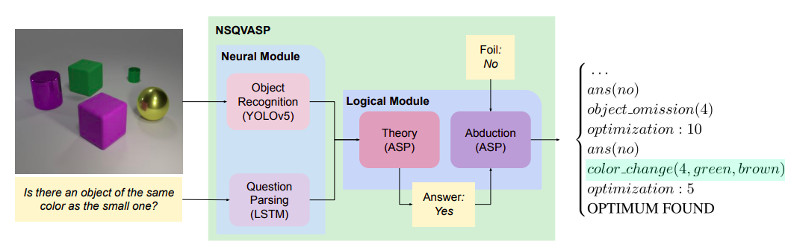
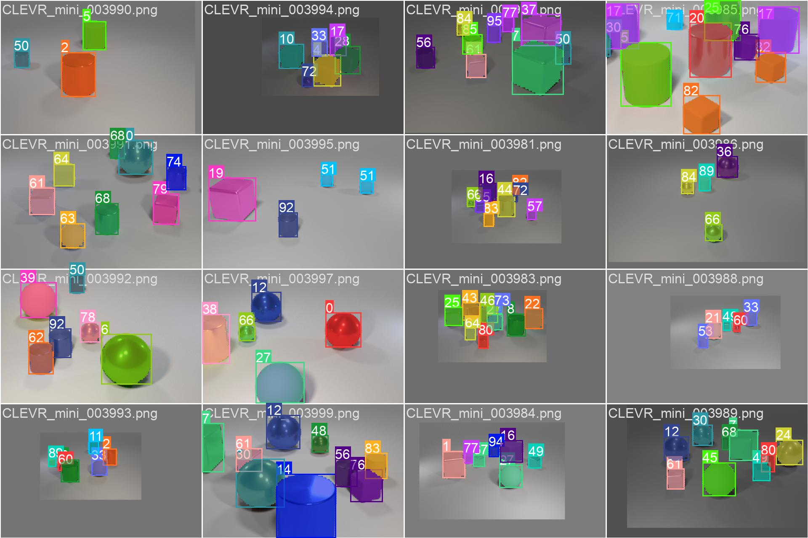
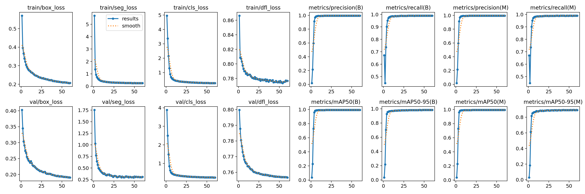
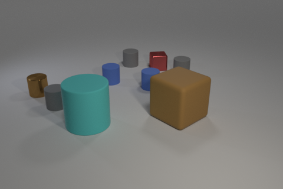
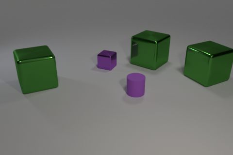

# Neural-Symbolic Visual Question Answering with Contrastive Explanation (NS-VQA-CE)

Implémetation Python du Github : (NSVQASP : https://github.com/pudumagico/nsvqasp) qui propose une technique de NS-VQA avec CE en ASP (Answer Set Programming) sur le **[CLEVR Dataset : https://cs.stanford.edu/people/jcjohns/clevr/]**

### Publication NSVQASP 2023
**[A Logic-based Approach to Contrastive Explainability for Neurosymbolic Visual Question Answering](https://www.ijcai.org/proceedings/2023/0408.pdf)**
https://www.ijcai.org/proceedings/2023/0408.pdf

<div align="center">
  
</div>

Basé lui-même sur les travaux de : https://github.com/kexinyi/ns-vqa (qui nous a servi de point de départ)

### Publication NSVQA 2018
**[Neural-Symbolic VQA: Disentangling Reasoning from Vision and Language Understanding](https://arxiv.org/abs/1810.02338)**

<div align="center">
  
</div>

<br>
Kexin Yi&ast;, 
[Jiajun Wu](https://jiajunwu.com/)&ast;, 
[Chuang Gan](http://people.csail.mit.edu/ganchuang/), 
[Pushmeet Kohli](https://sites.google.com/site/pushmeet/), 
[Antonio Torralba](http://web.mit.edu/torralba/www/), and
[Joshua B. Tenenbaum](https://web.mit.edu/cocosci/josh.html)
<br>
(* indicates equal contributions)
<br>
In Neural Information Processing Systems (*NeurIPS*) 2018.
<br>

```
@inproceedings{yi2018neural,
  title={Neural-symbolic vqa: Disentangling reasoning from vision and language understanding},
  author={Yi, Kexin and Wu, Jiajun and Gan, Chuang and Torralba, Antonio and Kohli, Pushmeet and Tenenbaum, Joshua B.},
  booktitle={Advances in Neural Information Processing Systems},
  pages={1039--1050},
  year={2018}
}
```

## Prérequis
* Python 3.10.13

## Pour faire tourner le code

Clonez ce répertoire
```
git clone https://github.com/vyktron/ns-vqa-ce.git
```

Créer un environnement et installez tous les packages listés dans `requirements.txt`
```
python3.10 -m venv /path/to/new/virtual/environment
pip install -r requirements.txt
```

Lancez la commande suivante dans votre terminal avec l'environnement activé pour faire tourner l'algorithme sur 10000 questions portant sur 1000 images.
```
python run.py --load_checkpoint_path data/pretrained/question_parser.pt --save_result_path data/reason/results --clevr_val_scene_path scene_parse/images/val_scene.json --clevr_vocab_path data/reason/clevr_h5/clevr_vocab.json
```

## Fonctionnement

### Etape 1 : Détection d'objets

Le détecteur d'objet est un modèle YoloV8n (Yolo version 8, nano = plus petit modèle) développé par ultralytics : (https://github.com/ultralytics/ultralytics)
Il s'agit donc d'une version plus performante et compacte que YoloV5, utilisé dans la publication "NSVQASP 2023".  
De plus il est possible de faire tourner ce modèle sur CPU uniquement, contrairement à l'implémentation Mask-R-CNN utilisé dans la publication initiale de 2018.

Le modèle n'est pas présent dans ce répertoire, seuls les résultats des segmentations des 1000 images sont présentes (dans le fichier ```scene_parse/images/val_scene.json```)

#### Exemple

<div align="center">
  
</div>

Le modèle a été entrainé sur un dataset nommé "CLEVR-Mini" qui contient 4000 images et les coordonnées de la segmentation de chaque objet.
Le modèle est capable de reconnaître 96 classes : (Taille_Couleur_Texture_Forme)
* "Large_Red_Metal_Sphere": 0,
* "Large_Red_Metal_Cube": 1,
* "Large_Red_Metal_Cylinder": 2,
* "Large_Red_Rubber_Sphere": 3,
* ...

Ensuite à partir des objets détectés et leurs coordonnées nous sommes capables d'obtenir le tableau des attributs de la scène.

#### Performance

<div align="center">
  
</div>

Le modèle converge effectivement avec notamment une **précision de 99,6%** pour les classes attribuées

### Etape 2: Question Parsing

L'objectif du question parsing est de traduire les questions formulées en langage naturel en fonctions applicable aux attributs de la scène.

#### Question
Are there more green objects than tiny rubber cylinders?  
*Existe-t-il plus d'objets verts que de petits cylindres en caoutchouc ?*

#### Processing
Un modèle **LSTM** (Long-Short Term Memory) est utilisé pour réaliser la question parsing.
Les LSTM sont adaptés à ce genre de tâches car ils permettent de bien gérer la temporalité des mots dans les questions ainsi que les dépendances à long terme.

1 - Tokenisation : La question est divisée en tokens (unités linguistiques) compréhensibles par le modèle.

2 - Inférence : Le modèle renvoit une suite de tokens correspondant aux fonctions de raisonnements (filtrer les objets rouges, métalliques...)

3 - Application des fonctions : Les fonctions sont appliquées dans l'ordre spécifié par le modèle. Ainsi la dernière fonction renvoit la réponse à la question.

#### Fonctions
"greater than ( count(filter_color(green)) , count( intersect( intersect(filter_size(small), filter_shape(cylinder)), filter_material(rubber) ) ) )" *9 fonctions*

-----

Sur 10000 questions nous obtenons un taux de bonnes réponses de **99,4%**
(Sachant que la détection d'objet a une précision de 99,6%, on peut difficilement dépasser ce pourcentage. La performance obtenu en 2018 était de 99,8%)

### Etape 3 : Contrastive Explanation

La dernière partie consiste à trouver un modification de la scène (bouger un objet, changer sa couleur, sa forme...) pour engendrer une réponse différente à une question donnée.  
Pour se faire on applique des transformations aléatoires à la scène. (Une modification peut-être une succession de transformations)

#### Exemples

How many red objects are small shiny blocks or small rubber balls ?  

<div align="center">
  
</div>

* Image : 998
* Predicted answer: 1
* Ground truth answer: 1
* Modified answer: 0
* Cost: 11
* Description: change_size 4 : small -> large
* Modified scene: [{'id': '998-0', 'position': [1.2073033273220062, 1.4945631957054137, 0.7], 'color': 'brown', 'material': 'rubber', 'shape': 'cube', 'size': 'large'}, {'id': '998-1', 'position': [1.6233381736278534, -2.141068323254585, 0.35], 'color': 'gray', 'material': 'rubber', 'shape': 'cylinder', 'size': 'small'}, {'id': '998-2', 'position': [-1.154744883775711, -1.1294089430570604, 0.35], 'color': 'blue', 'material': 'rubber', 'shape': 'cylinder', 'size': 'small'}, {'id': '998-3', 'position': [-1.693931791782379, 1.8313643437623979, 0.7], 'color': 'cyan', 'material': 'rubber', 'shape': 'cylinder', 'size': 'large'}, {'id': '998-4', 'position': [0.6711750781536102, -2.412887197732925, 0.7], 'color': 'red', 'material': 'metal', 'shape': 'cube', 'size': **'large'**}, {'id': '998-5', 'position': [0.3581746220588684, -0.5633923751115799, 0.35], 'color': 'blue', 'material': 'rubber', 'shape': 'cylinder', 'size': 'small'}, {'id': '998-6', 'position': [-3.7221895015239714, -0.08891469061374657, 0.35], 'color': 'brown', 'material': 'metal', 'shape': 'cylinder', 'size': 'small'}, {'id': '998-7', 'position': [-2.910327101945877, 0.874869332909584, 0.35], 'color': 'gray', 'material': 'rubber', 'shape': 'cylinder', 'size': 'small'}, {'id': '998-8', 'position': [-0.5011349391937258, -2.678761799931526, 0.35], 'color': 'gray', 'material': 'rubber', 'shape': 'cylinder', 'size': 'small'}]

---------

Are there fewer tiny shiny cubes than green metallic things ?

<div align="center">
  
</div>

* Image : 10
* Predicted answer: yes
* Ground truth answer: yes
* Modified answer: no
* Cost: 22
* Description: change_color 1 : green -> red; change_size 0 : large -> small
* Modified scene: [{'id': '10-0', 'position': [-3.292278846502304, 0.5576739799976349, 0.35], 'color': 'green', 'material': 'metal', 'shape': 'cube', 'size': **'small'**}, {'id': '10-1', 'position': [3.900321793556213, -0.026275967359542886, 0.7], 'color': **'red'**, 'material': 'metal', 'shape': 'cube', 'size': 'large'}, {'id': '10-2', 'position': [-0.43689026713371265, -1.1574226140975952, 0.35], 'color': 'purple', 'material': 'metal', 'shape': 'cube', 'size': 'small'}, {'id': '10-3', 'position': [1.6506794977188113, -1.5154066717624666, 0.7], 'color': 'green', 'material': 'metal', 'shape': 'cube', 'size': 'large'}, {'id': '10-4', 'position': [0.7856634902954102, 1.2383994382619856, 0.35], 'color': 'purple', 'material': 'rubber', 'shape': 'cylinder', 'size': 'small'}]

---------

How many other objects are there of the same color as the matte cylinder ?  

<div align="center">
  
</div>

* Image : 3
* Predicted answer: 1
* Ground truth answer: 1
* Modified answer: 10
* Cost: 11
* Description: change_material 5 : rubber -> metal
* Modified scene: [{'id': '3-0', 'position': [1.3302829301357268, -0.6800348329544067, 0.7], 'color': 'purple', 'material': 'metal', 'shape': 'sphere', 'size': 'large'}, {'id': '3-1', 'position': [0.25077290534973173, -3.094255012869835, 0.7], 'color': 'purple', 'material': 'metal', 'shape': 'sphere', 'size': 'large'}, {'id': '3-2', 'position': [-2.9378172171115873, 1.2698937779664992, 0.7], 'color': 'gray', 'material': 'rubber', 'shape': 'cube', 'size': 'large'}, {'id': '3-3', 'position': [-0.671323869228363, 3.4335732942819592, 0.35], 'color': 'yellow', 'material': 'rubber', 'shape': 'sphere', 'size': 'small'}, {'id': '3-4', 'position': [-1.843806345462799, 0.3182424312829972, 0.35], 'color': 'brown', 'material': 'metal', 'shape': 'cylinder', 'size': 'small'}, {'id': '3-5', 'position': [-1.3637827014923094, -1.3849538600444793, 0.35], 'color': 'brown', 'material': **'metal'**, 'shape': 'cylinder', 'size': 'small'}, {'id': '3-6', 'position': [1.810978947877884, -2.2910381257534027, 0.7], 'color': 'blue', 'material': 'metal', 'shape': 'cylinder', 'size': 'large'}]

Comme le cylindre "mate" n'est plus mate, car il est devenu métallique, la question se retrouve sans réel sens après cette modification.

